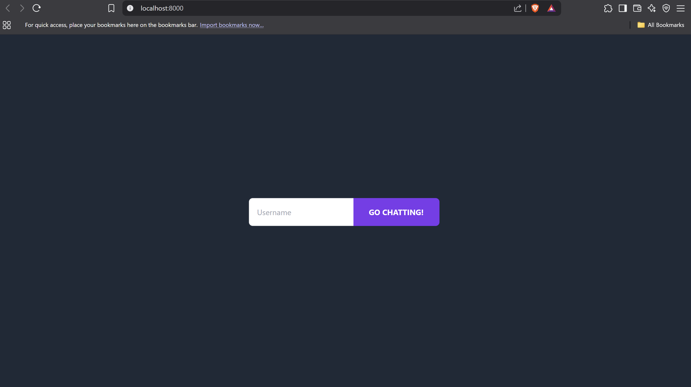
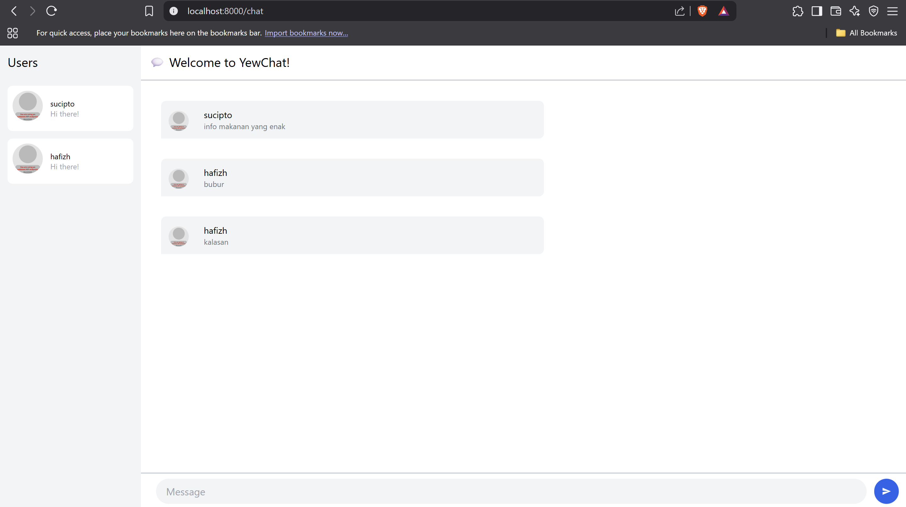
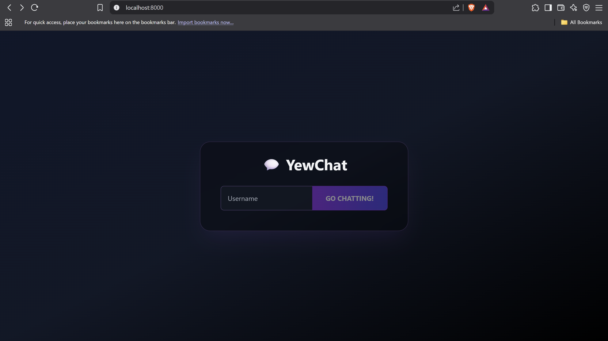
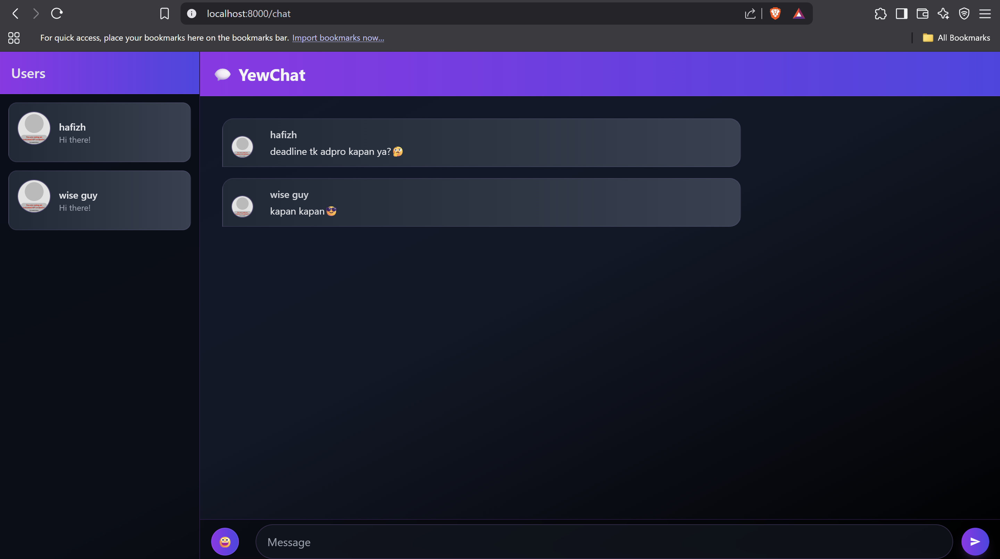

3.1. Original code

Setelah meng-clone repositori dari https://github.com/jtordgeman/YewChat/tree/websockets-part2 dan https://github.com/jtordgeman/SimpleWebsocketServer serta mengikuti panduan yang tersedia, saya berhasil membangun sebuah aplikasi chat yang memanfaatkan websocket. Pada aplikasi ini, pengguna diminta untuk memasukkan username terlebih dahulu sebelum dapat bergabung dan berkomunikasi dengan pengguna lain di dalam ruang obrolan.

3.2. Add some creativities to the webclient

Saya telah melakukan modifikasi signifikan pada komponen Chat dengan menambahkan fitur emoji picker dan mengubah tampilan visual secara menyeluruh. Pada komponen Chat, saya menambahkan enum Msg::ToggleEmojiPicker dan Msg::AddEmoji(String) untuk menangani interaksi emoji, serta field show_emoji_picker: bool pada struct Chat. Saya juga menambahkan konstanta EMOJIS yang berisi 24 emoji untuk memudahkan pemilihan ekspresi saat mengobrol.

Selain itu, saya mengubah seluruh skema warna dari tema terang (seperti gray-100, white, blue-600) menjadi tema gelap futuristik dengan nuansa gradien (slate-900, gray-900, black) dan aksen ungu-indigo. Saya juga menambahkan efek backdrop blur, border dengan opacity, serta meningkatkan padding dan rounded corners untuk menciptakan tampilan yang lebih modern dan menarik secara visual.

Pada komponen Login, saya menerapkan konsistensi tema yang sama dengan mengubah background menjadi gradien gelap, menambahkan container berbentuk card dengan efek backdrop blur, serta styling yang sejalan dengan tema baru tersebut. 